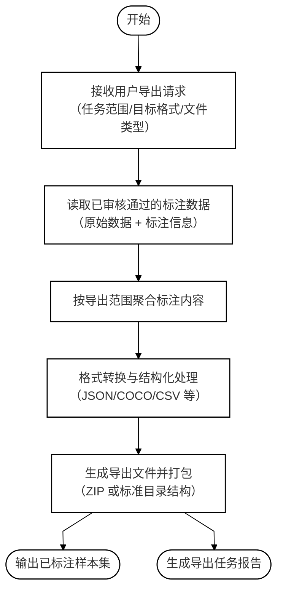

```mermaid
%%{init:{
  "flowchart":{"direction":"TB","curve":"linear","htmlLabels":true},
  "themeVariables":{
    "background":"transparent",
    "edgeLabelBackground":"transparent",
    "primaryTextColor":"#000",
    "lineColor":"#000",
    "fontSize":"16px"
  },
  "themeCSS":".edgeLabel rect{fill:transparent!important;stroke:transparent!important;}"
}}%%
flowchart TB

  A([开始]):::ellipse --> B[接收用户导出请求<br/>（任务范围/目标格式/文件类型）]:::rect
  B --> C[读取已审核通过的标注数据<br/>（原始数据 + 标注信息）]:::rect
  C --> D[按导出范围聚合标注内容]:::rect
  D --> E[格式转换与结构化处理<br/>（JSON/COCO/CSV 等）]:::rect
  E --> F[生成导出文件并打包<br/>（ZIP 或标准目录结构）]:::rect
  F --> G([输出已标注样本集]):::ellipse
  F --> H([生成导出任务报告]):::ellipse

  %% 样式
  classDef ellipse fill:transparent,stroke:#000,stroke-width:1.5px,rx:22,ry:22;
  classDef rect fill:transparent,stroke:#000,stroke-width:1.5px;

  class A,G,H ellipse;
  class B,C,D,E,F rect;

```