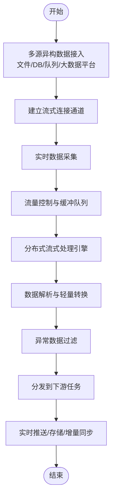

```mermaid
flowchart TD

    %% ===== 开始 =====
    A([开始])

    %% ===== 数据源接入（横向小扩展） =====
    A --> B1[多源异构数据接入<br/>文件/DB/队列/大数据平台]
    B1 --> B2[建立流式连接通道]

    %% ===== 流式采集阶段（紧凑中段） =====
    B2 --> C1[实时数据采集]
    C1 --> C2[流量控制与缓冲队列]

    %% ===== 分布式处理主干流程（略向下展开） =====
    C2 --> D1[分布式流式处理引擎]
    D1 --> D2[数据解析与轻量转换]
    D2 --> D3[异常数据过滤]

    %% ===== 数据分发（向右略扩展，美观） =====
    D3 --> E1[分发到下游任务]
    E1 --> E2[实时推送/存储/增量同步]

    %% ===== 结束 =====
    E2 --> F([结束])

```