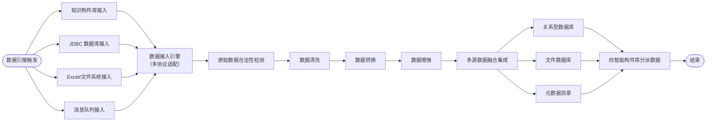

```mermaid
flowchart LR
    %% === 顶部：手动或自动触发 ===
    A([数据引接触发])

    %% === 第一排：多源数据接入入口 ===
    A --> B1[知识构件库接入]
    A --> B2[JDBC 数据库接入]
    A --> B3[Excel/文件系统接入]
    A --> B4[消息队列接入]

    %% === 第二排：接入层统一规范化 ===
    B1 --> C[数据接入引擎<br/>（多协议适配）]
    B2 --> C
    B3 --> C
    B4 --> C

    %% === 第三排：原始数据处理（横向流程）===
    C --> D1[原始数据合法性检测]
    D1 --> D2[数据清洗]
    D2 --> D3[数据转换]
    D3 --> D4[数据增强]

    %% === 第四排：结构化集成（中心位置）===
    D4 --> E[多源数据融合集成]

    %% === 第五排：统一存储 ===
    E --> F1[关系型数据库]
    E --> F2[文件数据库]
    E --> F3[元数据目录]

    %% === 第六排：向下游分派 ===
    F1 --> G[向智能构件库分派数据]
    F2 --> G
    F3 --> G

    %% === 底部结束 ===
    G --> H([结束])

```