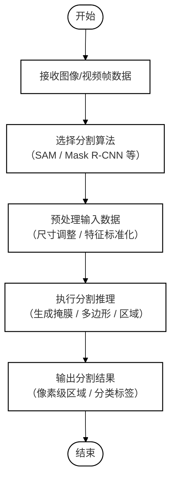

```mermaid
%%{init:{
  "flowchart":{"direction":"TB","curve":"linear","htmlLabels":true},
  "themeVariables":{
    "background":"transparent",
    "edgeLabelBackground":"transparent",
    "primaryTextColor":"#000",
    "lineColor":"#000",
    "fontSize":"16px"
  },
  "themeCSS":".edgeLabel rect{fill:transparent!important;stroke:transparent!important;}"
}}%%

flowchart TB

  A([开始]):::ellipse --> B[接收图像/视频帧数据]:::rect
  B --> C[选择分割算法<br/>（SAM / Mask R-CNN 等）]:::rect
  C --> D[预处理输入数据<br/>（尺寸调整 / 特征标准化）]:::rect
  D --> E[执行分割推理<br/>（生成掩膜 / 多边形 / 区域）]:::rect
  E --> F[输出分割结果<br/>（像素级区域 / 分类标签）]:::rect
  F --> G([结束]):::ellipse

  %% 样式
  classDef ellipse fill:transparent,stroke:#000,stroke-width:1.5px,rx:25,ry:25;
  classDef rect fill:transparent,stroke:#000,stroke-width:1.5px;

  class A,G ellipse;
  class B,C,D,E,F rect;

```