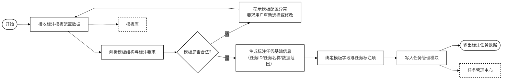

```mermaid
%%{init:{
  "flowchart":{"direction":"LR","curve":"linear","htmlLabels":true},
  "themeVariables":{
    "background":"transparent",
    "edgeLabelBackground":"transparent",
    "primaryTextColor":"#000",
    "lineColor":"#000",
    "fontSize":"16px"
  },
  "themeCSS":".edgeLabel rect{fill:transparent!important;stroke:transparent!important;}"
}}%%
flowchart LR

  A([开始]):::ellipse --> B[接收标注模板配置数据]:::rect
  B --> C[解析模板结构与标注要求]:::rect

  %% 分支判断
  C --> D{模板是否合法?}:::diamond

  %% 不合法分支
  D -->|否| E[提示模板配置异常<br/>要求用户重新选择或修改]:::rect
  E --> B

  %% 合法主流程
  D -->|是| F[生成标注任务基础信息<br/>（任务ID/任务名称/数据范围）]:::rect
  F --> G[绑定模板字段与任务标注项]:::rect
  G --> H[写入任务管理模块]:::rect
  H --> I([输出标注任务数据]):::ellipse

  %% 辅助节点
  B -.-> M[模板库]:::dashed
  H -.-> N[任务管理中心]:::dashed

  %% 样式定义
  classDef ellipse fill:transparent,stroke:#000,stroke-width:1.5px,rx:20,ry:20;
  classDef rect fill:transparent,stroke:#000,stroke-width:1.5px;
  classDef diamond fill:transparent,stroke:#000,stroke-width:1.5px;
  classDef dashed fill:transparent,stroke:#000,stroke-width:1.5px,stroke-dasharray:4 4;

  class A,I ellipse;
  class B,C,E,F,G,H rect;
  class D diamond;
  class M,N dashed;

```