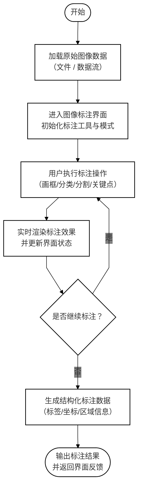

```mermaid
%%{init:{
  "flowchart":{"direction":"TB","curve":"linear","htmlLabels":true},
  "themeVariables":{
    "background":"transparent",
    "edgeLabelBackground":"transparent",
    "primaryTextColor":"#000",
    "lineColor":"#000",
    "fontSize":"16px"
  },
  "themeCSS":".edgeLabel rect{fill:transparent!important;stroke:transparent!important;}"
}}%%
flowchart TB

  A([开始]):::ellipse --> B[加载原始图像数据<br/>（文件 / 数据流）]:::rect
  B --> C[进入图像标注界面<br/>初始化标注工具与模式]:::rect

  %% 标注过程
  C --> D[用户执行标注操作<br/>（画框/分类/分割/关键点）]:::rect
  D --> E[实时渲染标注效果<br/>并更新界面状态]:::rect

  %% 循环：继续标注？
  E --> F{是否继续标注？}:::diamond
  F -->|是| D
  F -->|否| G[生成结构化标注数据<br/>（标签/坐标/区域信息）]:::rect

  G --> H([输出标注结果<br/>并返回界面反馈]):::ellipse

  %% 样式
  classDef ellipse fill:transparent,stroke:#000,stroke-width:1.5px,rx:22,ry:22;
  classDef rect fill:transparent,stroke:#000,stroke-width:1.5px;
  classDef diamond fill:transparent,stroke:#000,stroke-width:1.5px;

  class A,H ellipse;
  class B,C,D,E,G rect;
  class F diamond;

```