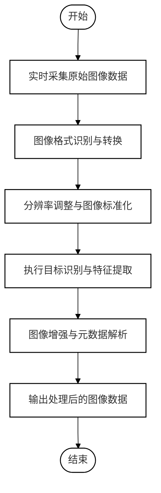

```mermaid
%%{init:{
  "flowchart":{"direction":"TB","curve":"linear","htmlLabels":true},
  "themeVariables":{
    "background":"transparent",
    "edgeLabelBackground":"transparent",
    "primaryTextColor":"#000000",
    "lineColor":"#000000",
    "fontSize":"16px"
  },
  "themeCSS":".edgeLabel rect{fill:transparent!important;stroke:transparent!important;}"
}}%%
flowchart TB
  A([开始]):::ellipse --> B[实时采集原始图像数据]:::rect
  B --> C[图像格式识别与转换]:::rect
  C --> D[分辨率调整与图像标准化]:::rect
  D --> E[执行目标识别与特征提取]:::rect
  E --> F[图像增强与元数据解析]:::rect
  F --> G[输出处理后的图像数据]:::rect
  G --> H([结束]):::ellipse

  %% 样式定义
  linkStyle default interpolate linear;
  classDef ellipse fill:transparent,stroke:#000,stroke-width:1.5px,rx:25,ry:25;
  classDef rect fill:transparent,stroke:#000,stroke-width:1.5px;
  class A,H ellipse;
  class B,C,D,E,F,G rect;

```