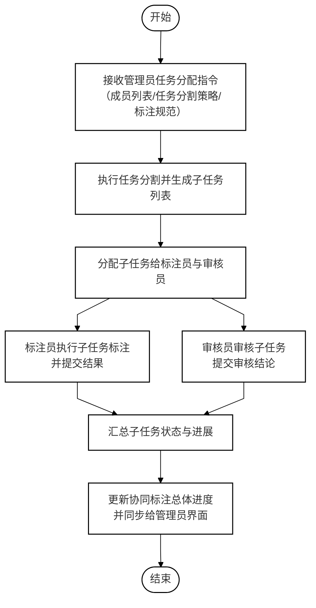

```mermaid
%%{init:{
  "flowchart":{"direction":"TB","curve":"linear","htmlLabels":true},
  "themeVariables":{
    "background":"transparent",
    "edgeLabelBackground":"transparent",
    "primaryTextColor":"#000",
    "lineColor":"#000",
    "fontSize":"16px"
  },
  "themeCSS":".edgeLabel rect{fill:transparent!important;stroke:transparent!important;}"
}}%%
flowchart TB

  A([开始]):::ellipse --> B[接收管理员任务分配指令<br/>（成员列表/任务分割策略/标注规范）]:::rect
  B --> C[执行任务分割并生成子任务列表]:::rect
  C --> D[分配子任务给标注员与审核员]:::rect

  %% 并行逻辑段
  D --> E1[标注员执行子任务标注<br/>并提交结果]:::rect
  D --> E2[审核员审核子任务<br/>提交审核结论]:::rect

  %% 汇总段
  E1 --> F[汇总子任务状态与进展]:::rect
  E2 --> F

  F --> G[更新协同标注总体进度<br/>并同步给管理员界面]:::rect
  G --> H([结束]):::ellipse

  %% 样式定义
  classDef ellipse fill:transparent,stroke:#000,stroke-width:1.5px,rx:22,ry:22;
  classDef rect fill:transparent,stroke:#000,stroke-width:1.5px;

  class A,H ellipse;
  class B,C,D,E1,E2,F,G rect;

```