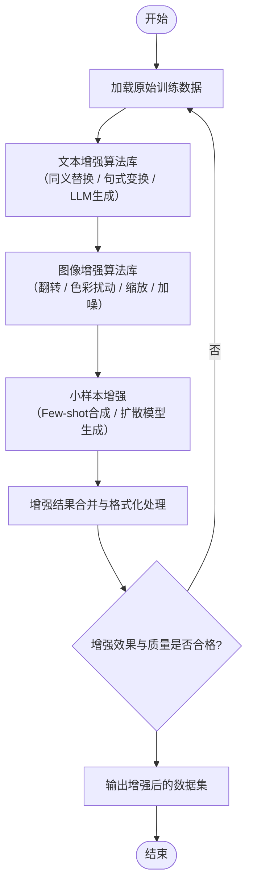

```mermaid
flowchart TD

    A([开始])

    %% ===== 数据输入与准备 =====
    A --> B[加载原始训练数据]

    %% ===== 区块一：文本增强 =====
    B --> C1[文本增强算法库<br/>（同义替换 / 句式变换 / LLM生成）]

    %% ===== 区块二：图像增强 =====
    C1 --> C2[图像增强算法库<br/>（翻转 / 色彩扰动 / 缩放 / 加噪）]

    %% ===== 区块三：小样本增强 =====
    C2 --> C3[小样本增强<br/>（Few-shot合成 / 扩散模型生成）]

    %% ===== 汇总处理 =====
    C3 --> D[增强结果合并与格式化处理]

    %% ===== 校验环节 =====
    D --> E{增强效果与质量是否合格?}

    %% ===== 不合格回环 =====
    E -->|否| B

    %% ===== 合格输出 =====
    E --> F[输出增强后的数据集]

    F --> G([结束])


```