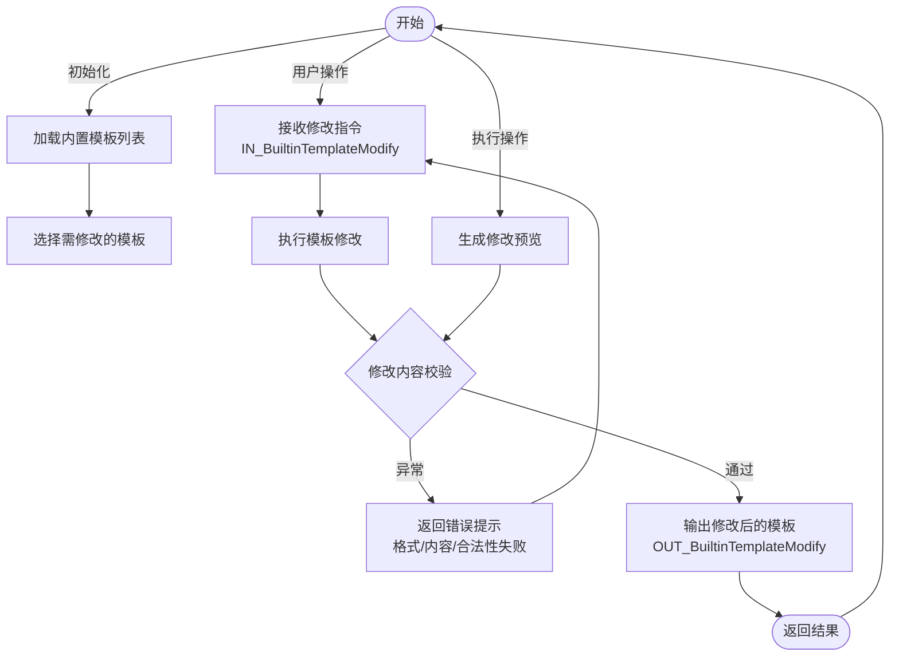

```mermaid
flowchart TD

    %% ===== 顶部：开始（椭圆） =====
    A([开始])

    %% ===== 左侧流程：加载与选择模板 =====
    A -->|初始化| B[加载内置模板列表]
    B --> C[选择需修改的模板]

    %% ===== 中心主流程：接收修改指令 & 执行修改 =====
    A -->|用户操作| D[接收修改指令<br/>IN_BuiltinTemplateModify]
    D --> E[执行模板修改]
    E --> F{修改内容校验}

    %% ===== 右侧流程：修改预览 =====
    A -->|执行操作| G[生成修改预览]
    G --> F

    %% ===== 异常处理流程 =====
    F -->|异常| H[返回错误提示<br/>格式/内容/合法性失败]
    H --> D

    %% ===== 修改成功输出 =====
    F -->|通过| I[输出修改后的模板<br/>OUT_BuiltinTemplateModify]
    I --> J([返回结果])

    %% ===== 底部闭环：回到开始，形成系统循环 =====
    J --> A

```