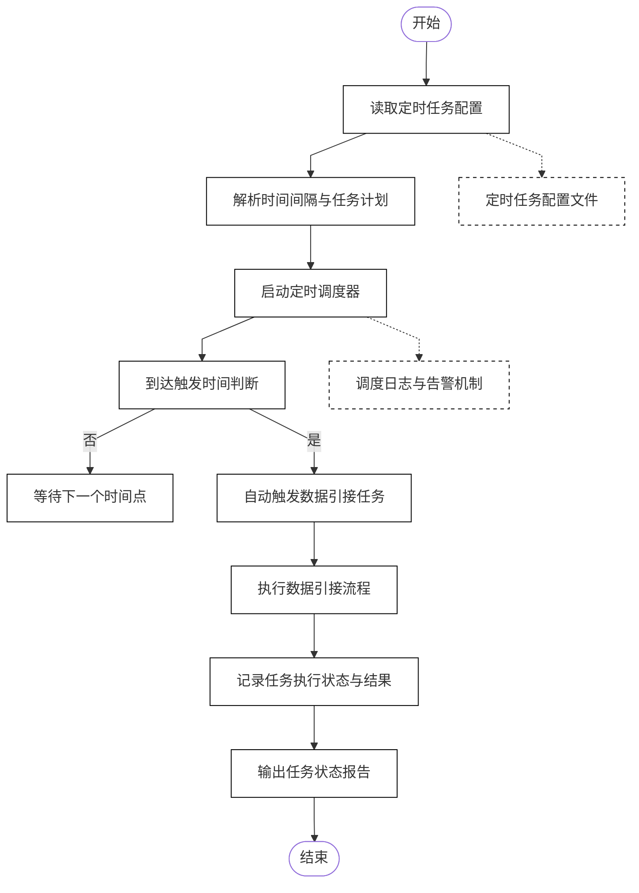

```mermaid
%%{init: {
  "flowchart": { "curve": "linear" },
  "themeCSS": ".edgeLabel rect{fill:#00000!important;stroke: #000 !important; }"
}}%%
flowchart TB
  A([开始]) --> B[读取定时任务配置]
  B --> C[解析时间间隔与任务计划]
  C --> D[启动定时调度器]
  D --> E[到达触发时间判断]
  E -- 否 --> G[等待下一个时间点]
  E -- 是 --> F[自动触发数据引接任务]
  F --> H[执行数据引接流程]
  H --> I[记录任务执行状态与结果]
  I --> J[输出任务状态报告]
  J --> K([结束])

  %% 辅助（水平虚线，直线）
  B -.-> L[定时任务配置文件]
  D -.-> M[调度日志与告警机制]

  %% 形状：首尾椭圆，其余矩形
  classDef ellipse fill:#ffffff,stroke:#0,stroke-width:1px,rx:25,ry:25;
  classDef rect    fill:#ffffff,stroke:#000,stroke-width:1px;
  classDef dashed  fill:#ffffff,stroke:#000,stroke-dasharray:4 4;
  class A,K ellipse;
  class B,C,D,E,F,G,H,I,J rect;
  class L,M dashed;
```