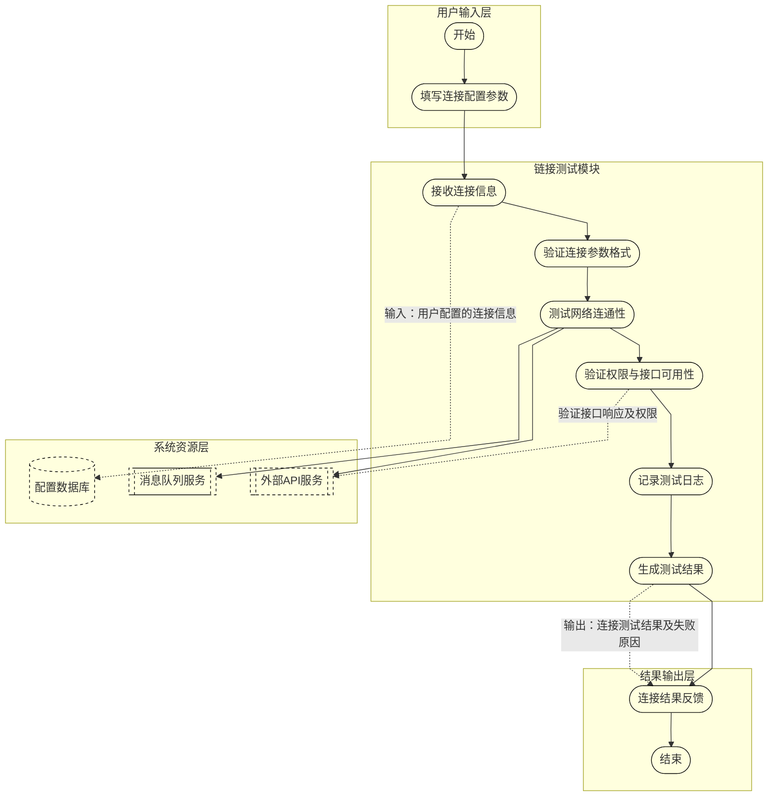

```mermaid
%%{init: {
  "flowchart": { "curve": "linear", layoutu:"elk" },
  "themeVariables": {
    "primaryColor": "transparent",
    "primaryTextColor": "#000000",
    "lineColor": "#000000",
    "background": "transparent",
    "edgeLabelBackground": "transparent",
    "fontSize": "14px"
  },
  "themeCSS": ".edgeLabel rect{fill:transparent!important;stroke:transparent!important;}.label foreignObject span{background:none!important;}"
}}%%
flowchart TB
  %% === 用户层 ===
  subgraph User[用户输入层]
    U1([开始])
    U2([填写连接配置参数])
  end

  %% === 链接测试模块 ===
  subgraph LinkTest[链接测试模块]
    C1([接收连接信息])
    C2([验证连接参数格式])
    C3([测试网络连通性])
    C4([验证权限与接口可用性])
    C5([记录测试日志])
    C6([生成测试结果])
  end

  %% === 系统资源层 ===
  subgraph Resource[系统资源层]
    DB[(配置数据库)]
    API[[外部API服务]]
    MQ[[消息队列服务]]
  end

  %% === 输出层 ===
  subgraph Output[结果输出层]
    O1([连接结果反馈])
    O2([结束])
  end

  %% === 主流程 ===
  U1 --> U2 --> C1 --> C2 --> C3 --> C4 --> C5 --> C6 --> O1 --> O2

  %% === 资源交互（垂直虚线连接） ===
  C1 -.->|输入：用户配置的连接信息| DB
  C3 --> API
  C3 --> MQ
  C4 -.->|验证接口响应及权限| API
  C6 -.->|输出：连接测试结果及失败原因| O1

  %% === 样式定义 ===
  linkStyle default interpolate linear;
  classDef ellipse fill:transparent,stroke:#000,stroke-width:1px,rx:25,ry:25;
  classDef rect fill:transparent,stroke:#000,stroke-width:1px;
  classDef dashed fill:transparent,stroke:#000,stroke-dasharray:4 4;
  class U1,O2 ellipse;
  class U2,C1,C2,C3,C4,C5,C6,O1 rect;
  class DB,API,MQ dashed;

```