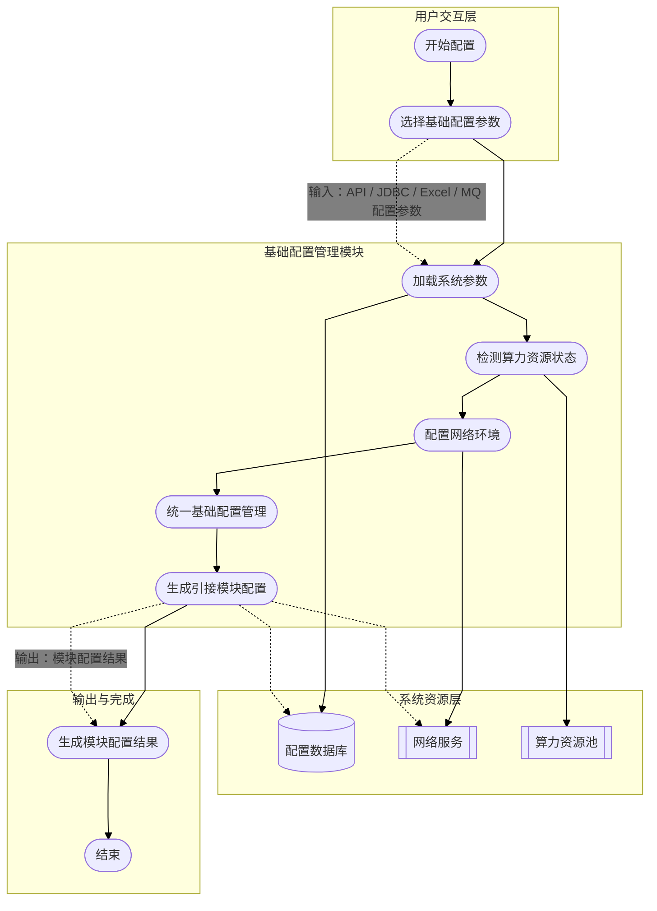

```mermaid
%%{init: {
  "flowchart": { "curve": "linear", "htmlLabels": true },
  "themeVariables": {
    "primaryColor": "transparent",
    "primaryTextColor": "#000000",
    "lineColor": "#000000",
    "background": "transparent",
    "edgeLabelBackground": "transparent",
    "fontSize": "14px"
  },
  "themeCSS": ".edgeLabel rect{fill:transparent!important;stroke:transparent!important;}.label foreignObject span{background:none!important;}"
}}%%
flowchart TB
  %% === 用户层 ===
  subgraph User[用户交互层]
    U1([开始配置])
    U2([选择基础配置参数])
  end

  %% === 配置管理模块 ===
  subgraph ConfigModule[基础配置管理模块]
    C1([加载系统参数])
    C2([检测算力资源状态])
    C3([配置网络环境])
    C4([统一基础配置管理])
    C5([生成引接模块配置])
  end

  %% === 系统资源层 ===
  subgraph SystemLayer[系统资源层]
    DB[(配置数据库)]
    NET[[网络服务]]
    RES[[算力资源池]]
  end

  %% === 输出层 ===
  subgraph Output[输出与完成]
    O1([生成模块配置结果])
    O2([结束])
  end

  %% === 主流程（垂直连接） ===
  U1 --> U2 --> C1 --> C2 --> C3 --> C4 --> C5 --> O1 --> O2

  %% === 交互与资源调用（直角连接） ===
  C1 --> DB
  C2 --> RES
  C3 --> NET
  C5 -.-> DB
  C5 -.-> NET

  %% === 辅助描述 ===
  U2 -.->|输入：API / JDBC / Excel / MQ 配置参数| C1
  C5 -.->|输出：模块配置结果| O1

  %% === 样式定义 ===
  linkStyle default interpolate linear;
  classDef ellipse fill:transparent,stroke:#000,stroke-width:1px,rx:25,ry:25;
  classDef rect fill:transparent,stroke:#000,stroke-width:1px;

```