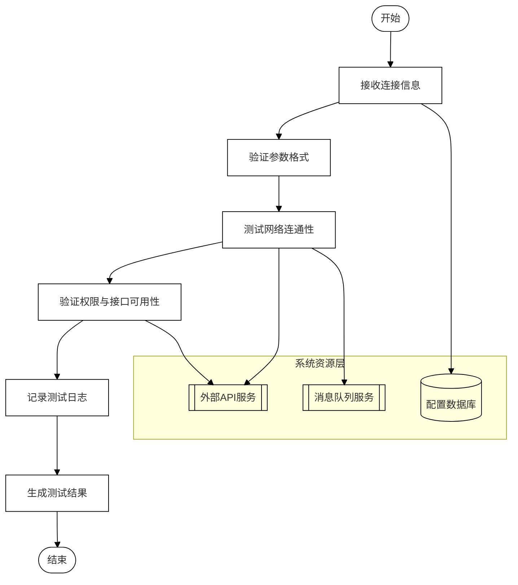

```mermaid
%%{init: {
  "flowchart": {
    "layout": "elk",
    "elk": {
      "edgeRouting": "ORTHOGONAL",
      "spacing.nodeNodeBetweenLayers": 50,
      "algorithm": "layered"
    },
    "htmlLabels": true
  },
  "themeVariables": {
    "background": "transparent",
    "edgeLabelBackground": "transparent",
    "primaryTextColor": "#000",
    "lineColor": "#000",
    "fontSize": "14px"
  },
  "themeCSS": ".edgeLabel rect{fill:transparent!important;stroke:transparent!important;}"
}}%%
flowchart TB
  A([开始]) --> B[接收连接信息]
  B --> C[验证参数格式]
  C --> D[测试网络连通性]
  D --> E[验证权限与接口可用性]
  E --> F[记录测试日志]
  F --> G[生成测试结果]
  G --> H([结束])

  subgraph Resource[系统资源层]
    DB[(配置数据库)]
    API[[外部API服务]]
    MQ[[消息队列服务]]
  end

  B --> DB
  D --> API
  D --> MQ
  E --> API

  classDef ellipse fill:transparent,stroke:#000,stroke-width:1px,rx:25,ry:25;
  classDef rect fill:transparent,stroke:#000,stroke-width:1px;
  class A,H ellipse;
  class B,C,D,E,F,G,DB,API,MQ rect;

```