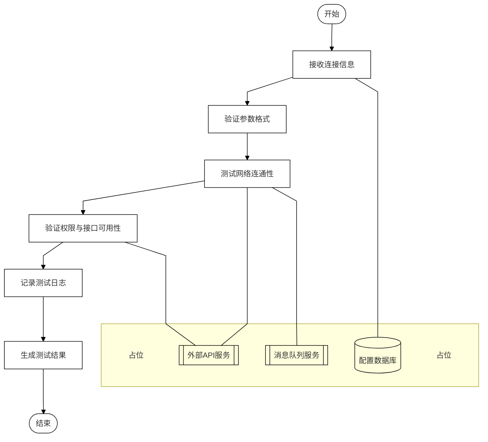

```mermaid
%%{init:{
  "flowchart":{"curve":"linear","htmlLabels":true},
  "themeVariables":{
    "background":"transparent",
    "edgeLabelBackground":"transparent",
    "primaryTextColor":"#000",
    "lineColor":"#000",
    "fontSize":"14px"
  },
  "themeCSS":".edgeLabel rect{fill:transparent!important;stroke:transparent!important;}"
}}%%
flowchart TB
  %% 主列（严格竖直）
  A([开始]) --> B[接收连接信息]
  B --> C[验证参数格式]
  C --> D[测试网络连通性]
  D --> E[验证权限与接口可用性]
  E --> F[记录测试日志]
  F --> G[生成测试结果]
  G --> H([结束])

  %% 资源列（与主列并排，避免斜线）
  subgraph Col2[  ]
    direction TB
    P1[[占位]]:::blank
    API[[外部API服务]]
    MQ[[消息队列服务]]
    DB[(配置数据库)]
    P2[[占位]]:::blank
  end

  %% 横向连接（水平）+ 再竖直回主列（保证直角）
  B ---- DB
  D ---- API
  D ---- MQ
  E ---- API

  %% 样式：透明背景、方框、首尾椭圆
  classDef ellipse fill:transparent,stroke:#000,stroke-width:1px,rx:25,ry:25;
  classDef rect    fill:transparent,stroke:#000,stroke-width:1px;
  classDef blank   fill:transparent,stroke:transparent;
  class A,H ellipse;
  class B,C,D,E,F,G,API,MQ,DB rect;

```