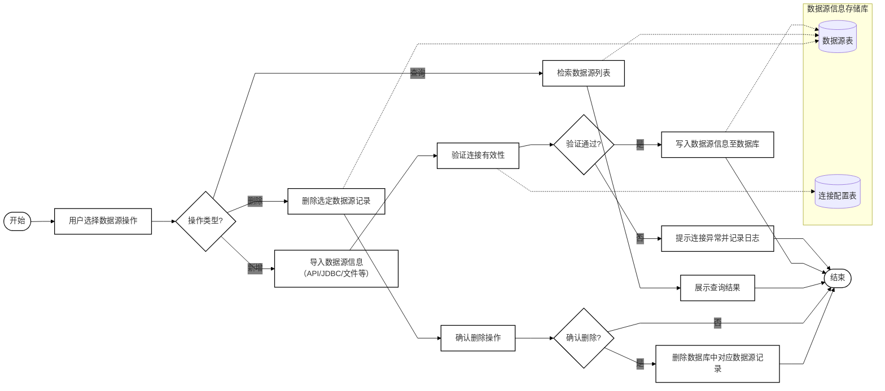

```mermaid
%%{init:{
  "flowchart":{"direction":"LR","curve":"linear","htmlLabels":true},
  "themeVariables":{
    "background":"transparent",
    "edgeLabelBackground":"transparent",
    "primaryTextColor":"#000000",
    "lineColor":"#000000",
    "fontSize":"16px"
  },
  "themeCSS":".edgeLabel rect{fill:transparent!important;stroke:transparent!important;}"
}}%%
flowchart LR
  %% === 起点 ===
  A([开始]):::ellipse --> B[用户选择数据源操作]:::rect

  %% === 分支判断 ===
  B --> C{操作类型?}:::diamond
  C -- 新增 --> D1[导入数据源信息（API/JDBC/文件等）]:::rect
  C -- 查询 --> D2[检索数据源列表]:::rect
  C -- 删除 --> D3[删除选定数据源记录]:::rect

  %% === 新增流程 ===
  D1 --> E1[验证连接有效性]:::rect
  E1 --> F1{验证通过?}:::diamond
  F1 -- 否 --> G1[提示连接异常并记录日志]:::rect
  F1 -- 是 --> H1[写入数据源信息至数据库]:::rect
  G1 --> I([结束]):::ellipse
  H1 --> I

  %% === 查询流程 ===
  D2 --> H2[展示查询结果]:::rect
  H2 --> I

  %% === 删除流程 ===
  D3 --> E3[确认删除操作]:::rect
  E3 --> F3{确认删除?}:::diamond
  F3 -- 否 --> I
  F3 -- 是 --> G3[删除数据库中对应数据源记录]:::rect
  G3 --> I

  %% === 数据存储模块 ===
  subgraph DB[数据源信息存储库]
    direction TB
    DB1[(数据源表)]
    DB2[(连接配置表)]
  end
  H1 -.-> DB1
  D2 -.-> DB1
  D3 -.-> DB1
  E1 -.-> DB2

  %% === 样式定义 ===
  classDef ellipse fill:transparent,stroke:#000,stroke-width:1.5px,rx:25,ry:25;
  classDef rect fill:transparent,stroke:#000,stroke-width:1.5px;
  classDef diamond fill:transparent,stroke:#000,stroke-width:1.5px;
  classDef cylinder fill:transparent,stroke:#000,stroke-width:1.5px;
  class A,I ellipse;

```