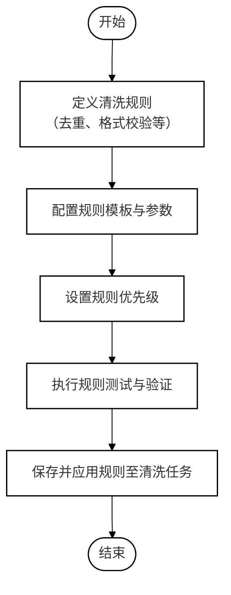

```mermaid
%%{init:{
  "flowchart":{"direction":"TB","curve":"linear","htmlLabels":true},
  "themeVariables":{
    "background":"transparent",
    "edgeLabelBackground":"transparent",
    "primaryTextColor":"#000000",
    "lineColor":"#000000",
    "fontSize":"16px"
  },
  "themeCSS":".edgeLabel rect{fill:transparent!important;stroke:transparent!important;}"
}}%%
flowchart TB
  A([开始]):::ellipse --> B[定义清洗规则<br/>（去重、格式校验等）]:::rect
  B --> C[配置规则模板与参数]:::rect
  C --> D[设置规则优先级]:::rect
  D --> E[执行规则测试与验证]:::rect
  E --> F[保存并应用规则至清洗任务]:::rect
  F --> G([结束]):::ellipse

  %% 样式定义
  linkStyle default interpolate linear;
  classDef ellipse fill:transparent,stroke:#000,stroke-width:1.5px,rx:25,ry:25;
  classDef rect fill:transparent,stroke:#000,stroke-width:1.5px;
  class A,G ellipse;
  class B,C,D,E,F rect;

```