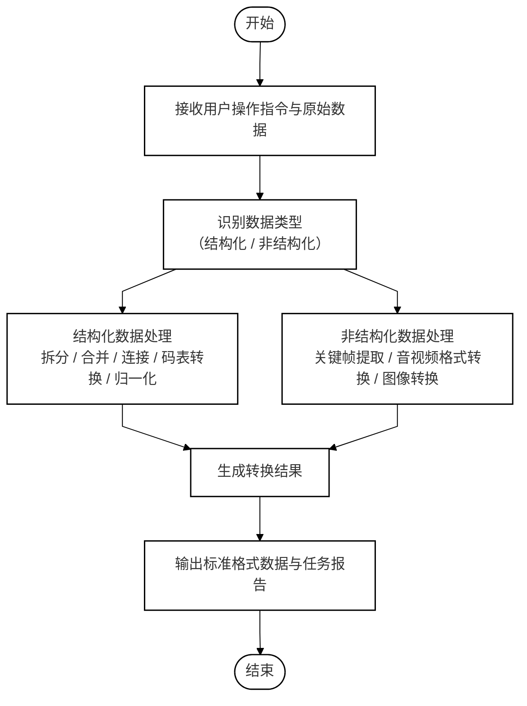

```mermaid
%%{init:{
  "flowchart":{"direction":"TB","curve":"linear","htmlLabels":true},
  "themeVariables":{
    "background":"transparent",
    "edgeLabelBackground":"transparent",
    "primaryTextColor":"#000000",
    "lineColor":"#000000",
    "fontSize":"16px"
  },
  "themeCSS":".edgeLabel rect{fill:transparent!important;stroke:transparent!important;}"
}}%%
flowchart TB
  A([开始]):::ellipse --> B[接收用户操作指令与原始数据]:::rect
  B --> C[识别数据类型<br/>（结构化 / 非结构化）]:::rect
  
  %% 结构化数据转换
  C --> D1[结构化数据处理<br/>拆分 / 合并 / 连接 / 码表转换 / 归一化]:::rect
  
  %% 非结构化数据转换
  C --> D2[非结构化数据处理<br/>关键帧提取 / 音视频格式转换 / 图像转换]:::rect
  
  %% 合并流程
  D1 --> E[生成转换结果]:::rect
  D2 --> E
  
  E --> F[输出标准格式数据与任务报告]:::rect
  F --> G([结束]):::ellipse

  %% 样式定义
  linkStyle default interpolate linear;
  classDef ellipse fill:transparent,stroke:#000,stroke-width:1.5px,rx:25,ry:25;
  classDef rect fill:transparent,stroke:#000,stroke-width:1.5px;
  class A,G ellipse;
  class B,C,D1,D2,E,F rect;

```